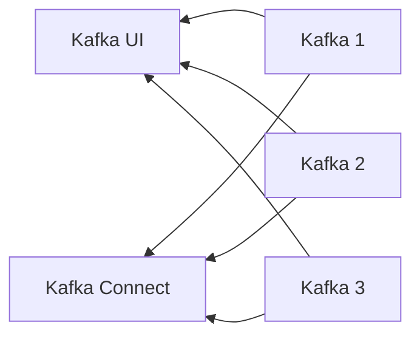

# Kafka Setup

## Table of Contents
- [Description](#description)
- [Structure](#structure)
- [Environment Variables](#environment-variables)
- [Usage](#usage)
  - [Setup Environment Variables](#setup-environment-variables)
  - [Start](#start)

## Description
This is a simple Kafka setup for small size projects. It is based on
the [confluentinc/cp-kafka](https://hub.docker.com/r/confluentinc/cp-kafka/) image.

## Structure


## Environment Variables

| Key                | Description                  | Example        |
|--------------------|------------------------------|----------------|
| PROFILE            | Kafka-ui cluster name        | local          |
| KAFKA_1_PORT       | Kafka port                   | 9092           |
| KAFKA_2_PORT       | Kafka port                   | 9093           |
| KAFKA_3_PORT       | Kafka port                   | 9094           |
| KAFKA_CONNECT_PORT | Kafka connect port           | 8083           |
| KAFKA_DIR          | Kafka data dir source        | kafka_data     |
| KAFKA_UI_PORT      | Kafka UI port                | 9000           |
| DOCKER_HOST_IP     | Kafka external IP (Optional) | 127.0.0.1      |

## Usage

### Setup Environment Variables

```bash
$ cp .env.example .env
```

👉 Edit the .env file
```bash
$ vim .env
# or
$ vi .env
``
KAFKA_1_PORT=9092
KAFKA_2_PORT=9093
KAFKA_3_PORT=9094
KAFKA_CONNECT_PORT=8083
KAFKA_DIR=kafka_data
KAFKA_UI_PORT=9000
DOCKER_HOST_IP=127.0.0.1
``
```

### Start

```bash
$ docker-compose up -d
```