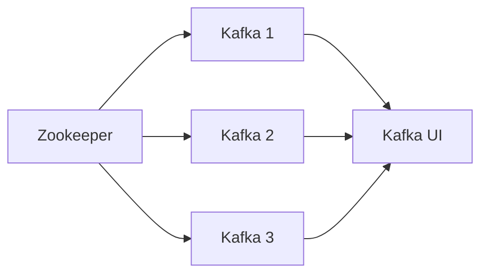

# Kafka Setup

## Table of Contents
- [Description](#description)
- [Structure](#structure)
- [Environment Variables](#environment-variables)
- [Usage](#usage)
  - [Setup Environment Variables](#setup-environment-variables)
  - [Start](#start)

## Description
This is a simple Kafka setup for small size projects. It is based on
the [confluentinc/cp-kafka](https://hub.docker.com/r/confluentinc/cp-kafka/) image.

## Structure


## Environment Variables

| Key            | Description               | Example        |
|----------------|---------------------------|----------------|
| ZOOKEEPER_PORT | Zookeeper port            | 2181           |
| ZOOKEEPER_DIR  | Zookeeper data dir source | zookeeper_data |
| PROFILE        | Kafka-ui cluster name     | local          |
| KAFKA_1_PORT   | Kafka port                | 9092           |
| KAFKA_2_PORT   | Kafka port                | 9093           |
| KAFKA_3_PORT   | Kafka port                | 9094           |
| KAFKA_DIR      | Kafka data dir source     | kafka_data     |
| KAFKA_UI_PORT  | Kafka UI port             | 9000           |

## Usage

### Setup Environment Variables

```bash
$ cp .env.example .env
```

👉 Edit the .env file
```bash
$ vim .env
# or
$ vi .env
``
ZOOKEEPER_PORT=2181
ZOOKEEPER_DIR=zookeeper_data
KAFKA_1_PORT=9092
KAFKA_2_PORT=9093
KAFKA_3_PORT=9094
KAFKA_DIR=kafka_data
KAFKA_UI_PORT=9000
``
```

### Start

```bash
$ docker-compose up -d
```